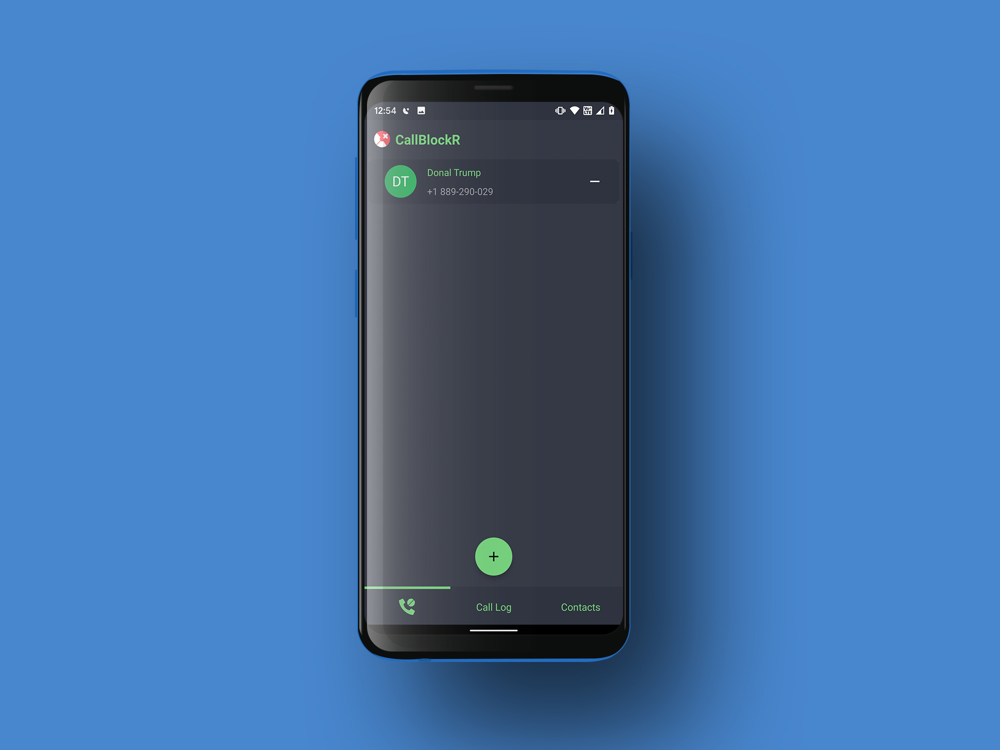
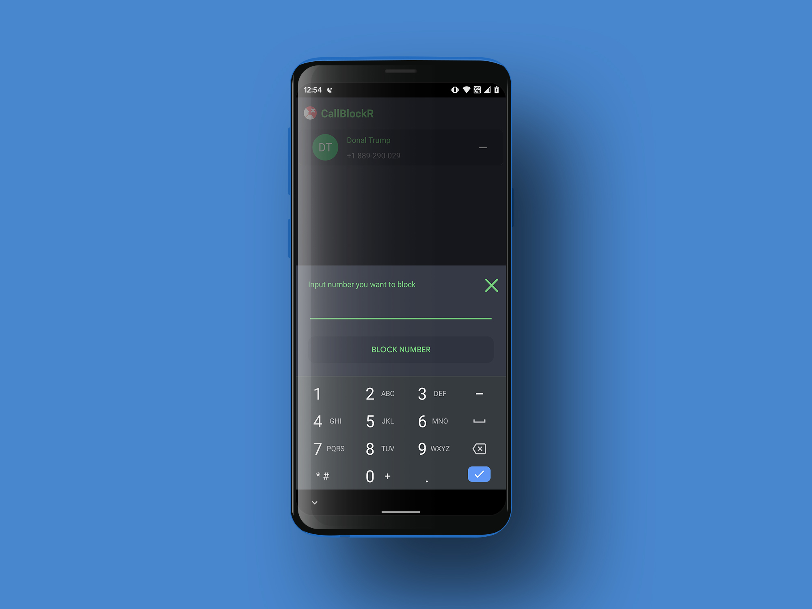
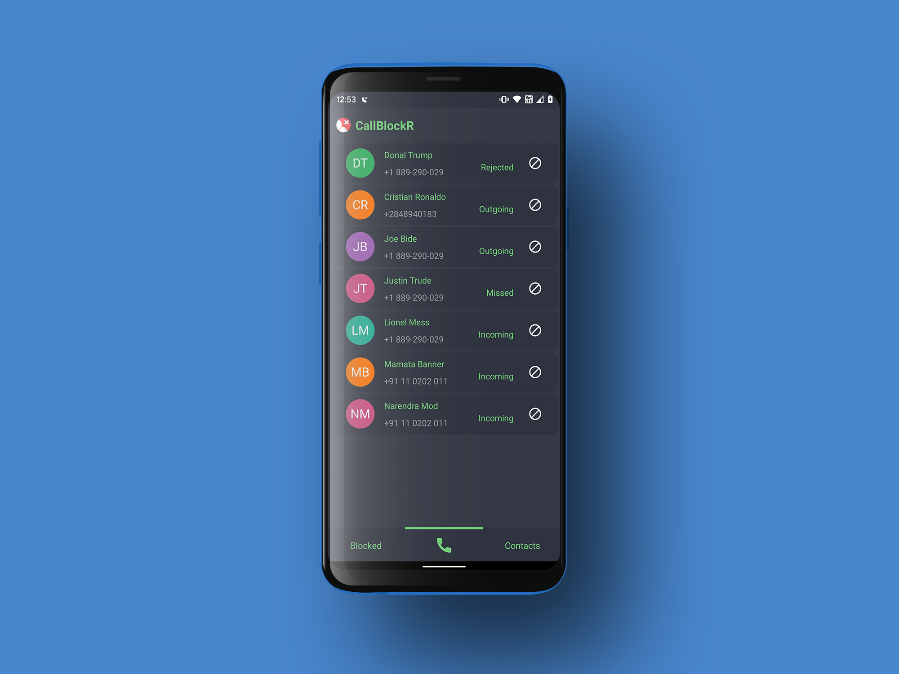
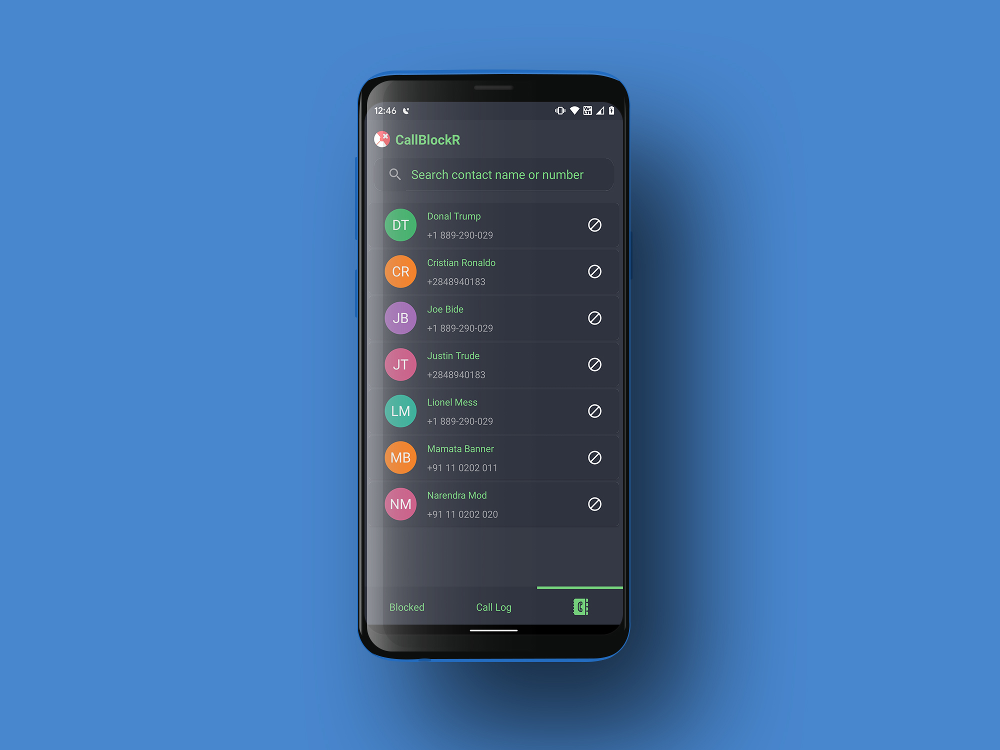
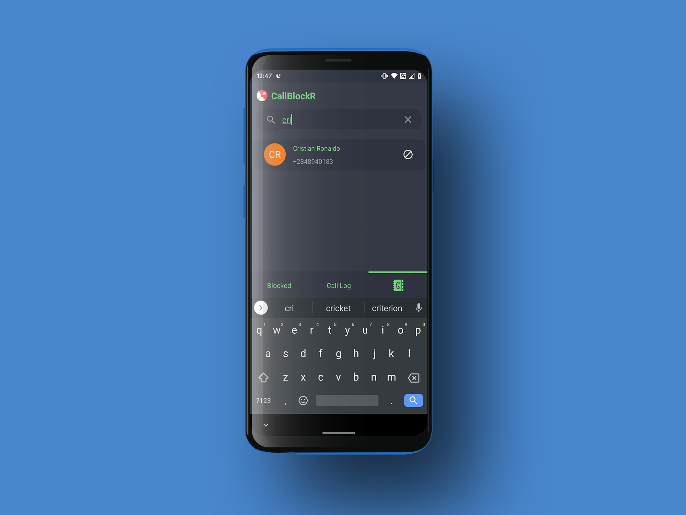
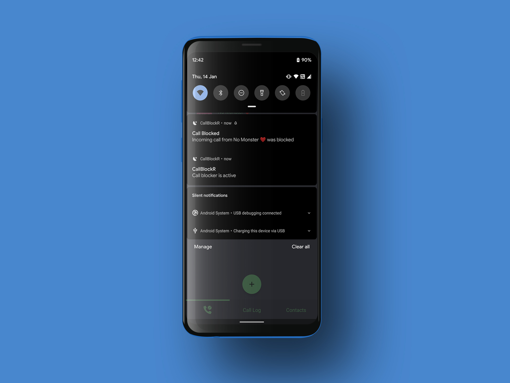

# CallBlockR
A privacy first, open-source call blocking app.

 

# Table of Contents
- [Introduction](#introduction)  
- [UI Samples](#ui-samples)  
- [Features](#features)  
- [Architecture](#things-to-look-out-for) 
- [Installation](#installation)  
- [Acknowledgements](#acknowledgements)  
- [About the Author](#about-the-author) 

## Introduction
CallBlockR is a beautiful call blocking app which values user privacy over everything else.

It implements:-
- the [MVVM](https://medium.com/upday-devs/android-architecture-patterns-part-3-model-view-viewmodel-e7eeee76b73b) pattern
- DI using [Hilt](https://developer.android.com/training/dependency-injection/hilt-android)
- using [Coroutines](https://kotlinlang.org/docs/reference/coroutines-overview.html) to perform background thread operations
- using [Room](https://developer.android.com/training/data-storage/room?gclid=Cj0KCQiA9P__BRC0ARIsAEZ6iri4OPfc0B6ShpQOET_6iUpmuJFUQVVchLj1Y941zUX183rbOUO8E80aAkwQEALw_wcB&gclsrc=aw.ds) database for storing data locally.
- serves and maintains the data state using [LiveData](https://developer.android.com/reference/android/arch/lifecycle/LiveData)

## UI Samples

  
  

 

  
  

  
  

## Features
Using CallBlockR you can
- Block a contact directly from your phone contact list
- Block a phone-number from your phone call log
- Block a number by inputting manually
- Get a notification whenever a call was blocked

## Architecture

## Installation
This project should work right away after cloning.
              
## Acknowledgements
Special thanks to [Deep Joshi](https://twitter.com/imdeepjoshi) for providing the awesome app icon!

## Request to you
If you like it, please leave a ⭐ on this repository 😁

## About the Author

### Abhriya Roy

 Android Developer with 3 years of experience in building apps that look and feel great. 
 Enthusiastic towards writing clean and maintainable code.
 Open source contributor.

      &nbsp;
  
 &nbsp;
  
 &nbsp;
 
 &nbsp;
 

  
          
  
